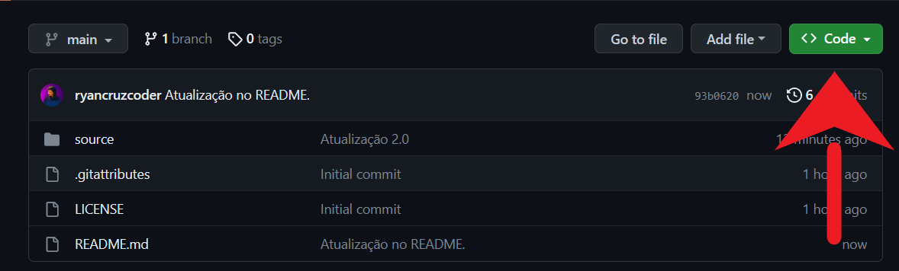
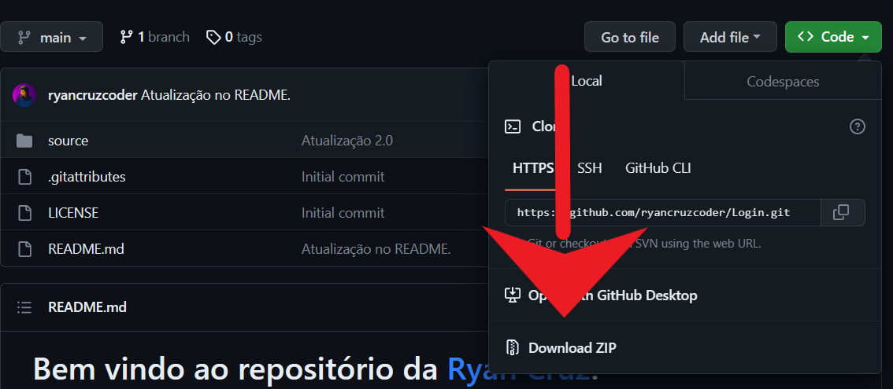

<h1>Bem vindo ao repositório do <a href="https://www.instagram.com/_ryancruzzz/">Ryan Cruz</a>!</h1>

Descubra como o poder da programação pode <strong>mudar o futuro</strong> e a <strong>sua vida!</strong>

<h3 dir="auto">Redes Sociais:</h3>

<h1 tabindex="-1" dir="auto"><a id="user-content-instruções-de-como-usar-este-script" class="anchor" aria-hidden="true" href="#instruções-de-como-usar-este-script"><svg class="octicon octicon-link" viewBox="0 0 16 16" version="1.1" width="16" height="16" aria-hidden="true"><path d="m7.775 3.275 1.25-1.25a3.5 3.5 0 1 1 4.95 4.95l-2.5 2.5a3.5 3.5 0 0 1-4.95 0 .751.751 0 0 1 .018-1.042.751.751 0 0 1 1.042-.018 1.998 1.998 0 0 0 2.83 0l2.5-2.5a2.002 2.002 0 0 0-2.83-2.83l-1.25 1.25a.751.751 0 0 1-1.042-.018.751.751 0 0 1-.018-1.042Zm-4.69 9.64a1.998 1.998 0 0 0 2.83 0l1.25-1.25a.751.751 0 0 1 1.042.018.751.751 0 0 1 .018 1.042l-1.25 1.25a3.5 3.5 0 1 1-4.95-4.95l2.5-2.5a3.5 3.5 0 0 1 4.95 0 .751.751 0 0 1-.018 1.042.751.751 0 0 1-1.042.018 1.998 1.998 0 0 0-2.83 0l-2.5 2.5a1.998 1.998 0 0 0 0 2.83Z"></path></svg></a>Instruções de utilização deste Script:</h1>
<ul dir="auto">
<li>Se já usou o Github antes já deve saber como fazer o download deste arquivo.</li>
<li>Caso contrário, veja o que fazer abaixo:</li>
</ul>
<h1 tabindex="-1" dir="auto"><a id="user-content-como-baixar-os-arquivos" class="anchor" aria-hidden="true" href="#como-baixar-os-arquivos"><svg class="octicon octicon-link" viewBox="0 0 16 16" version="1.1" width="16" height="16" aria-hidden="true"><path d="m7.775 3.275 1.25-1.25a3.5 3.5 0 1 1 4.95 4.95l-2.5 2.5a3.5 3.5 0 0 1-4.95 0 .751.751 0 0 1 .018-1.042.751.751 0 0 1 1.042-.018 1.998 1.998 0 0 0 2.83 0l2.5-2.5a2.002 2.002 0 0 0-2.83-2.83l-1.25 1.25a.751.751 0 0 1-1.042-.018.751.751 0 0 1-.018-1.042Zm-4.69 9.64a1.998 1.998 0 0 0 2.83 0l1.25-1.25a.751.751 0 0 1 1.042.018.751.751 0 0 1 .018 1.042l-1.25 1.25a3.5 3.5 0 1 1-4.95-4.95l2.5-2.5a3.5 3.5 0 0 1 4.95 0 .751.751 0 0 1-.018 1.042.751.751 0 0 1-1.042.018 1.998 1.998 0 0 0-2.83 0l-2.5 2.5a1.998 1.998 0 0 0 0 2.83Z"></path></svg></a>Como baixar os arquivos:</h1>
<ol dir="auto">
<li>

Clique no botão verde para fazer o download

</li>
<li>

Clique em Download ZIP

</li>
</ol>

 
